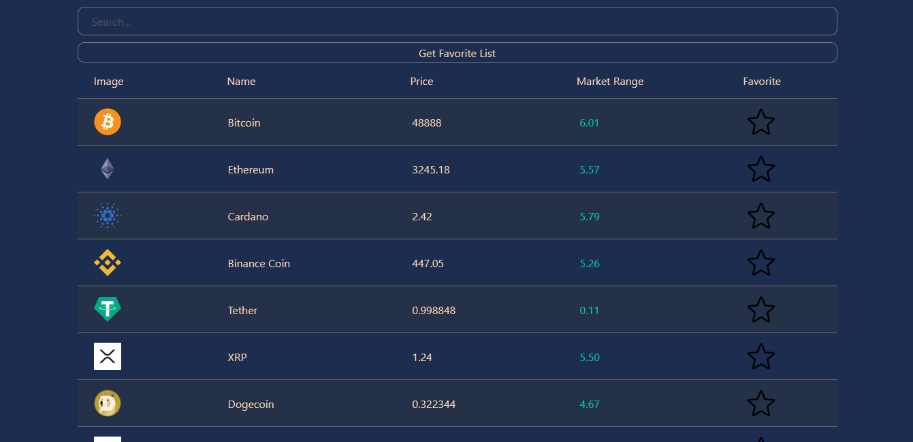
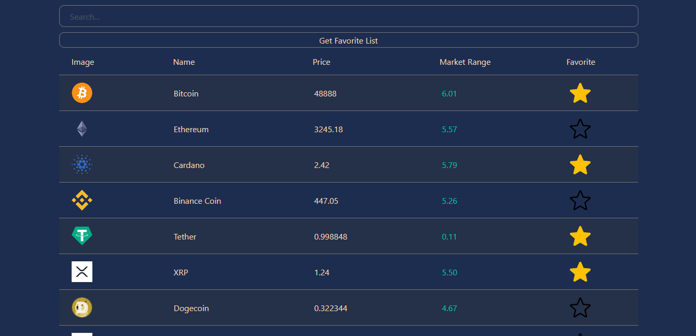
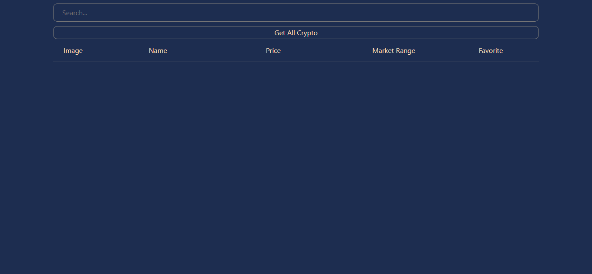
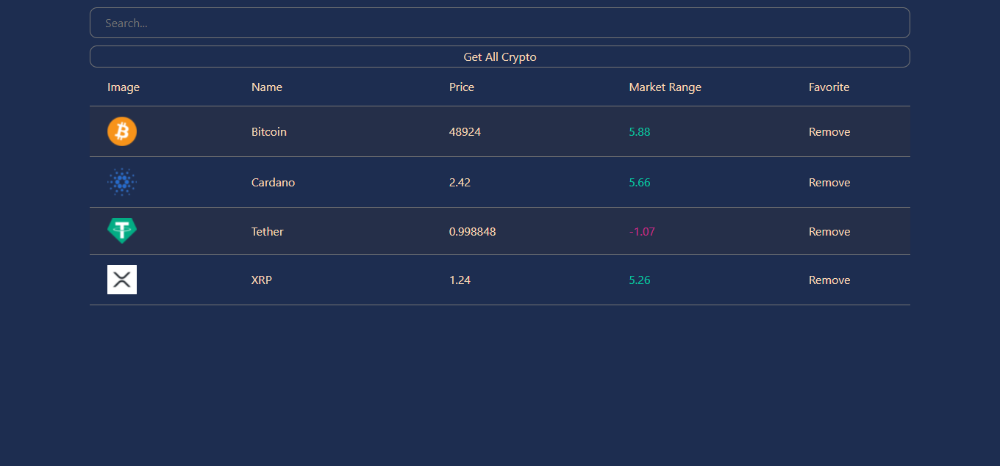
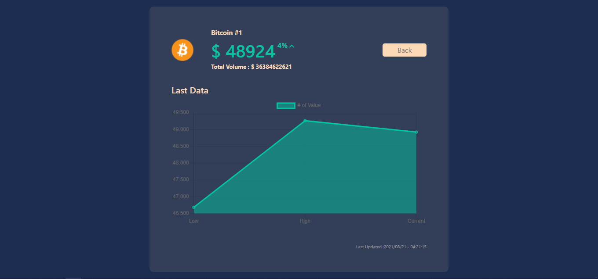

# Kripto Para Bilgilendirme Uygulaması

Uygulamamızda, API'den çekilen kripto para bilgilerini listeliyoruz. Search kısmını kullanarak da arama işleminizi gerçekleştirebiliyorsunuz.

## Proje Hakkında

Bu projede, Ana sayfada bütün kripto paraların güncel bilgilerine erişebilirsiniz. Bu bilgiler API'den çekilmektedir. Sayfanın üst kısmındaki search barından ise aramak istediğiniz kripto paranın adını yazabilirsiniz. Kripto paralarınızı favorilere ekleyebilir ve "Get Favorite List" tuşuna basarak görüntüleyebilirsiniz.

## Proje Teknik Bilgileri

* Dinamik Url yapısı için React-Router-Dom kullanılmıştır.
* Bilgiler API'den çekilmiştir. Bunun için CoinGecko kullanılmıştır.
* API'den veri çekmek için AXIOS kullanılmıştır.
* Paraların 24 saat içinde düşük / anlık / yüksek değerlerinin grafiği için ChartJS kullanılmıştır.
* API bir kere çekilmiş olup, context yapısı ile gerekli sayfalarda kullanılmıştır.
* Tarih bilgisinin formatı için Moment kullanılmıştır.
* Container yapısı için Bootstrap kullanılmıştır.

## Proje Nasıl Çalıştırılır

- Projeyi fork'ladıktan ya da indirdikten sonra projenin bulunduğu klasörde "npm install" komutu ile gerekli paketlerin yüklenmesi gerekiyor.
- Daha sonra "npm run start" komutu ile uygulama başlatılabilir.

 

## Ekran Görüntüsü

### Home Page

  

  

### Favorite Page

  

  

### Single Coin Page

  

## Developers
---
[Oğuzcan Uzunöner](https://github.com/oguzcanuzunoner)
 

[Doğancan Ülgü](https://github.com/dogancanulgu)
 

[Samet Çetin](https://github.com/imsamet)

## Licence
---
[MIT](https://choosealicense.com/licenses/mit/)
